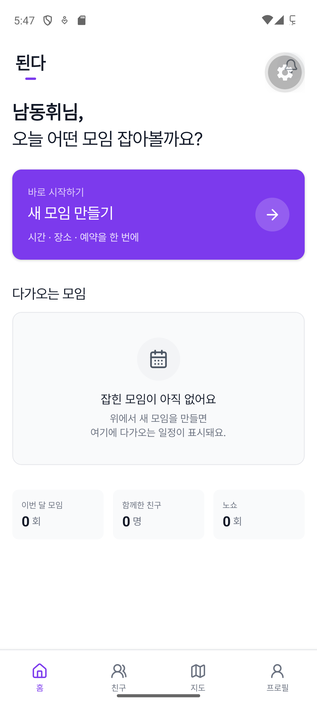
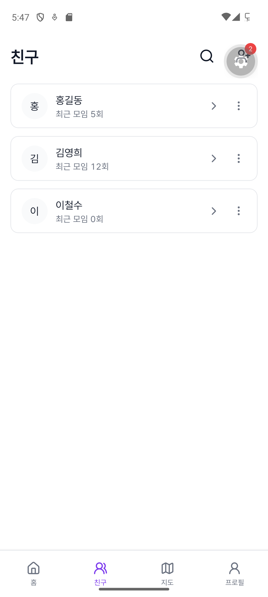
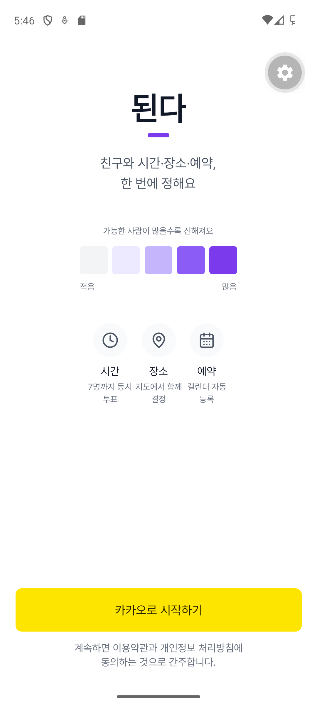
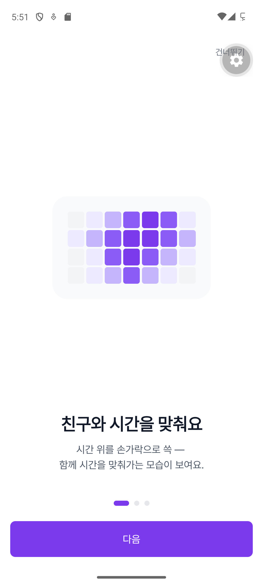

# 된다 (DenDa) — 친구와 시간·장소·예약을 한 번에 잡는 소셜 스케줄링 앱

> React Native (Expo) social scheduling app: Kakao login, 15-minute drag-select time grid, group voting → confirm → place pick on Naver Map, Everytime timetable OCR (Gemini Vision), Google/Apple calendar sync, push. Supabase with 24 migrations + 10 Edge Functions, 163 test files + Maestro e2e, EAS 3-channel builds. Built with a production-grade `.claude/` harness.

**한 줄로**: "언제 어디서 볼까?"를 앱 하나로 끝낸다. 모임을 만들고, 15분 단위 시간 그리드에서 가능한 시간을 드래그로 고르고, 투표 결과로 확정한 뒤 지도에서 장소를 정한다. 비회원 친구는 카톡 링크로 바로 투표한다.

<p align="center">
  
  
  
  
</p>

## 무엇을 만들었나
- 카카오 OIDC 로그인(Supabase `signInWithIdToken`), 온보딩, 약관.
- 모임 생성 → 시간 투표(15분 슬롯, 드래그 멀티셀렉트) → 확정 → 장소 선택(네이버 지도 + 카카오 Local 검색, 반경·카테고리·제휴 마커).
- 게스트 비회원 투표: 별도 Next.js 웹앱(`web-guest/`) + 자체 deferred deep link + 4자리 코드 폴백.
- 에브리타임 시간표 스크린샷 OCR(Gemini Vision, Edge Function `ocr_everytime`) → 개인 일정 자동 등록.
- Google / Apple 캘린더 단방향 동기화, 푸시 알림 F1~F5(Edge Functions `notify_f1`~`notify_f5`).
- 홈 캘린더(월/일 뷰, 반복 일정), 친구 추가/요청, 다크모드 시스템 자동.
- "예약하기" 클릭 로깅(Gate #2 측정) — 실제 결제는 Phase 3로 잠금.

## 왜 이렇게 만들었나 (설계 결정)
- **가장 어려웠던 문제**: 솔로 개발 + AI 에이전트로 4만 LOC를 일관되게 유지하는 것. 답은 코드보다 앞선 **하네스**였다. `CLAUDE.md`(정책) → `.claude/rules/`(파일 경로별 자동 로드 규칙) → `.claude/skills/{start-task, ship-task, design-check}`(절차) → `.claude/hooks/design-guard.sh`(디자인 토큰 위반 하드 차단) → `.claude/agents/reviewer`(읽기 전용 리뷰). 하네스 자체의 설계 스펙이 `harness_setting/`에 있다.
- **결정은 번호로 참조한다.** `docs/DECISIONS.md` D1~D44가 유일한 결정 기록이고, 커밋 메시지와 코드 주석이 D 번호를 인용한다. `docs/OPEN_QUESTIONS.md`의 의문은 결정으로 닫힐 때 `Closed by D{N}`을 남긴다.
- **7대 절대 규칙**: 디자인 토큰 외 시각 결정 금지, TDD 의무, KST 명시(`new Date()` 금지, luxon), 한국어 UI, 결정 즉시 기록, Phase 3 코드 금지, secret 클라이언트 노출 금지(HMAC·Kakao secret·Gemini key는 Edge Function에서만).
- **기각한 것**: 외부 예약 API 직결(캐치테이블 등), Memories 기능, attribution SaaS·도메인 구매(D28: 자체 deferred deep link).
- 게이트로 출시를 결정한다: 모임 확정 → 장소 확정 ≥40%, 장소 확정 → 예약 클릭 ≥25%면 Phase 3(토스 결제) 진입.

## 어떻게 검증했나
| 층 | 도구 | 수 |
|---|---|---|
| 단위·컴포넌트 | Jest (src 인라인 + `tests/`) | 163 파일 |
| Edge Function | Deno test (`_test.ts`) | 12 |
| 웹 게스트 | Playwright | 7 |
| E2E 실기기 | Maestro | 4 플로우 (kakao_oauth, host_create_group, member_vote, place_select_click_through) |
| 시각 회귀 | Figma 역방향 export 툴체인 (`tools/figma-export`, `npm run figma`) | 5단계 파이프라인 |
| 디자인 토큰 | `design-guard.sh` 훅 + `/design-check` | 위반 시 편집 차단 |

CI 워크플로는 없다. `docs/BUG_HUNT_2026-07-25.md`, `docs/DEVICE_TEST_CHECKLIST.md`에 실기기 검증 기록이 있다.

## 기술 스택
Expo 56 · React Native 0.85 · React 19 · expo-router · Zustand · luxon · Supabase (Auth/Postgres/RLS/Realtime/Edge Functions Deno) · `@react-native-kakao` · `@mj-studio/react-native-naver-map` · Google Calendar API · Gemini Vision · expo-notifications/calendar/secure-store/updates · EAS (dev/preview/production) · Next.js 16 (`web-guest/`)

## 실행 방법
```bash
npm install
cp .env.example .env.local          # Supabase URL/anon key 등
npx expo start                      # dev client
npm test                            # Jest
# 실기기: .claude/skills/run-denda-device 참고, EAS 빌드는 docs/EAS_BUILD_RUNBOOK.md
```

## 프로젝트 구조
```
app/                 expo-router 화면 (tabs: 홈·친구·[+]·지도·프로필)
src/components/      calendar · vote · map · friends …
src/lib/             groups · schedules · calendar(recurrence, agenda) · kst …
supabase/migrations/ 0001~0024 (RLS, RPC, pg_cron)
supabase/functions/  ocr_everytime · votes_aggregate · group_confirm · notify_f1~f5 · click_log · attribution_* · calendar_push_worker
web-guest/           비회원 투표 웹 (Next.js)
maestro/             실기기 e2e 플로우
docs/                PRD · ARCHITECTURE · DESIGN · DECISIONS(D1~D44) · TEST_PLAN · EAS_BUILD_RUNBOOK …
.claude/             rules · skills · hooks · agents   ← 하네스
harness_setting/     하네스 설계 스펙
```

## 상태
Phase 1+2 베타(예약·결제 제외) 기능 구현 완료, EAS 3채널 빌드 구성. 현재 브랜치(`feat/map-maphost-m0`)에는 홈 캘린더(월 뷰·일별 아젠다·개인 일정 시트·반복 일정) 작업이 진행 중이다. 스토어 배포 전.
